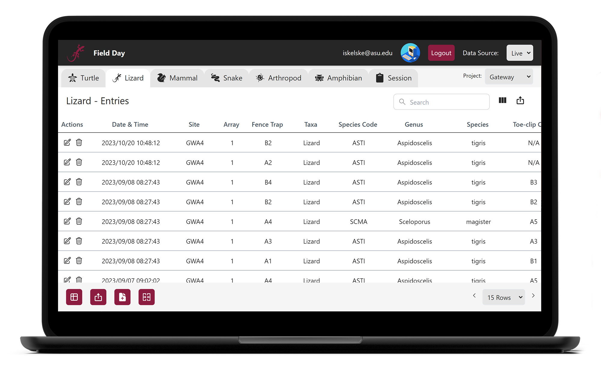

# Field Day Web UI

Welcome to the Field Day Web UI repository! This project is a desktop web application designed for managing wildlife data collected in the field.



## Project Overview

Field Day Web UI is an essential tool for viewing, managing, and exporting wildlife data collected by researchers using the Field Day mobile app. The application is optimized for use on larger screens, such as laptops, desktop computers, and tablets.

## Key Features

-   **Data Management**: Efficiently view, search, edit, and sort collected data in a table view.
-   **Dynamic Data Loading**: Data is loaded dynamically from the database based on user activity to optimize performance and reduce costs.
-   **Google Authentication**: Enhanced authentication security with 2-factor Google authentication.
-   **Data Export**: Export data to CSV format for further analysis.
-   **Answer Sets Management**: Manage answer sets, which are templates for data input specifying permissible data types for given fields.

## Development Stack

     

## Setup and Installation

### Prerequisites

-   [Node.js](https://nodejs.org/en/download/)
-   [npm](https://www.npmjs.com/get-npm)
-   [Firebase Account](https://firebase.google.com/)

### Installation

1. Clone the repository:
    ```bash
    git clone https://github.com/Field-Day-2022/field-day-2022-webUI.git
    cd field-day-2022-webUI
    ```
2. Install dependencies:
    ```bash
    npm install
    ```
3. Set up Firebase:
   // TODO: Add instructions for setting up Firebase

4. Start the development server:
    ```bash
    npm run dev
    ```
5. Open the application in your browser at `http://localhost:3000`.
6. You're all set! 🎉

## Sponsor

Professor Heather Bateman - Professor and Researcher of Biology

## Contributors

### 2022
<a href="https://github.com/ilathem"></a>
<a href="https://github.com/jakBkwik"></a>
<a href="https://github.com/realdgrassl"></a>  
<a href="https://github.com/ianskelskey"></a> 
<a href="https://github.com/zacharyjacobson"></a>